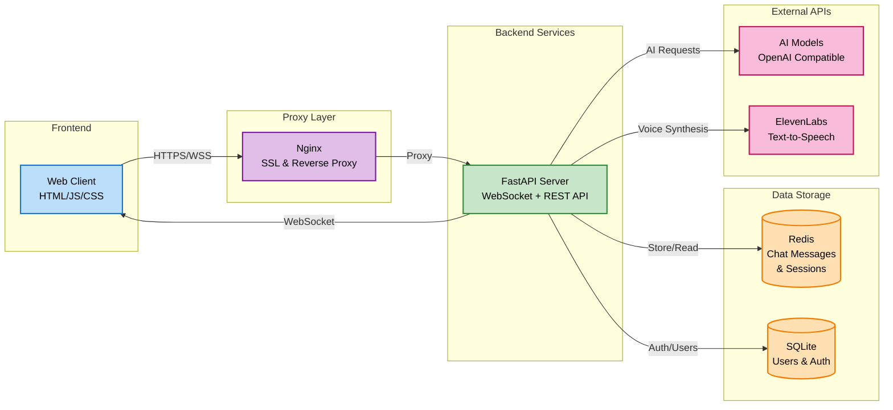

# Multi-User AI Chat

A secure, real-time multi-user chat application with advanced AI integration, role-based access control, voice synthesis, and comprehensive user management. Built with Python FastAPI backend, modern HTML/JavaScript frontend, Redis, and SQLite in a fully containerized architecture.

## 🏗️ Architecture Overview



### Key Components

- **Frontend**: Modern responsive web client with real-time updates
- **Backend**: FastAPI-based WebSocket server with comprehensive REST API
- **Chat Storage**: Redis for real-time chat rooms and message persistence
- **User Database**: SQLite for user authentication and management
- **AI Integration**: Multiple AI model support via OpenAI-compatible API
- **Voice Synthesis**: ElevenLabs TTS integration with Web Speech API fallback
- **Reverse Proxy**: Nginx with SSL termination and WebSocket support
- **Containerization**: Complete Docker setup with health monitoring

## ✨ Key Features

<details>
<summary>🔐 Authentication & Security</summary>

- **JWT-based Authentication**: Secure token-based login system
- **Role-Based Access Control (RBAC)**: Admin, User, and Kid account types
- **Session Management**: Configurable token expiration and auto-logout
- **Rate Limiting**: API and WebSocket connection rate limiting
</details>

<details>
<summary>👥 User Management (Admin Features)</summary>

- **User Creation & Management**: Full CRUD operations for user accounts
- **Role Assignment**: Admin, User, and Kid account designation
- **Password Management**: Secure password reset functionality
- **Kid Account Protection**: Restricted access and special safety features
</details>
<details>
<summary>🏠 Advanced Room Management</summary>

- **Multiple Chat Rooms**: Create unlimited themed chat rooms
- **Private Rooms**: Admin-controlled private rooms with user assignments
- **Room Permissions**: Role-based room creation and access control
- **Custom AI Configuration**: Per-room AI models and system prompts
- **Room Settings**: Configurable descriptions, AI behavior, and voice settings
</details>
<details>
<summary>🤖 Intelligent AI Integration</summary>

- **Multiple AI Models**: Support for different AI models per room
- **Custom System Prompts**: Room-specific AI personality configuration
- **Context-Aware Responses**: Chat history integration for coherent conversations
- **Smart Triggers**: Flexible AI activation via mentions and keywords
</details>
<details>
<summary>🔊 Voice & Text-to-Speech</summary>

- **ElevenLabs Integration**: High-quality voice synthesis for AI responses
- **Voice Selection**: Room-specific voice assignments
- **Web Speech Fallback**: Browser-based TTS when ElevenLabs unavailable
- **Voice Controls**: Real-time stop/start controls during playback
- **Accessibility**: Enhanced experience for visually impaired users
</details>
<details>
<summary>💬 Real-Time Communication</summary>

- **WebSocket Chat**: Instant message delivery and real-time updates
- **User Presence**: Online/offline status tracking
- **Message History**: Persistent chat history with configurable limits
- **User Mentions**: @username notification system
- **Help System**: Built-in !help command with feature documentation
</details>
<details>
<summary>🎨 User Experience</summary>

- **Responsive Design**: Mobile-first responsive interface
- **Real-Time Updates**: Live user lists, room updates, and notifications
- **Accessibility**: Keyboard navigation and screen reader support
</details>
<details>
<summary>📱 Kid Account Safety Features</summary>

- **Restricted Access**: Limited to assigned private rooms and general chat
- **Admin Oversight**: Admin-controlled room assignments
</details>

## 🔧 Configuration

### Environment Variables

| Variable | Default | Description |
|----------|---------|-------------|
| `REDIS_HOST` | localhost | Redis server hostname |
| `REDIS_PORT` | 6379 | Redis server port |
| `BACKEND_HOST` | localhost | Backend server host |
| `BACKEND_PORT` | 8000 | Backend server port |
| `AI_MODEL_URL` | http://localhost:1234 | AI model API endpoint |
| `AI_API_KEY` | None | API key for AI model (if needed) |
| `JWT_SECRET_KEY` | auto-generated | Secret key for JWT tokens |
| `ACCESS_TOKEN_EXPIRE_MINUTES` | 480 | JWT token expiration time (8 hours) |
| `ADMIN_USERNAME` | admin | Default admin username |
| `ADMIN_PASSWORD` | admin123! | Default admin password (**CHANGE ME!**) |
| `MAX_MESSAGE_LENGTH` | 2000 | Maximum message length |
| `MAX_CHAT_HISTORY` | 100 | Messages to keep in history |
| `AI_RESPONSE_TIMEOUT` | 30 | AI response timeout (seconds) |

### Full Configuration Options

See `env.example` for complete configuration options including:
- AI model settings and API keys
- Authentication and security settings
- Rate limiting and performance tuning
- Database and Redis configuration
- SSL and networking options


## 🚀 Quick Start

### Prerequisites

1. **Docker & Docker Compose** (recommended for full deployment)
2. **Python 3.11+** (for local development)
3. **AI Model Server** with OpenAI-compatible API
4. **ElevenLabs API Key** (optional, for voice synthesis)

### Rapid Deployment (Docker)

```bash
# Clone the repository
git clone <repository-url>
cd ai-chat-workspace

# One-command setup and deployment
make all

# Or step by step:
make setup     # Create directories and configuration
make build     # Build Docker images
make deploy    # Deploy production stack
make status    # Check service health
```

### Development Environment

```bash
# Setup for local development
make setup install

# Start services
make dev

# View logs
make logs-backend

# Access at http://localhost:3000 or https://localhost:3443
```

### Manual Setup (Advanced)

1. **Environment Configuration**:
   ```bash
   cp env.example .env
   # Edit .env with your AI model URL and API keys
   ```

2. **Start Services**:
   ```bash
   docker-compose up -d
   ```

3. **Access Application**:
   - HTTP: `http://localhost:3000`
   - HTTPS: `https://localhost:3443`
   - API: `http://localhost:8000`

## 💬 Usage Guide

### First Time Setup

1. **Access the Application**: Navigate to your deployment URL
2. **Admin Login**: Use default credentials (`admin` / `admin123!`)
3. **Change Admin Password**: Immediately update default credentials
4. **Create Users**: Add users with appropriate roles via User Management
5. **Create Rooms**: Set up chat rooms with custom AI configurations

### User Roles & Permissions

| Role | Room Access | Room Creation | User Management | Private Rooms |
|------|-------------|---------------|-----------------|---------------|
| **Admin** | All rooms | ✅ Yes | ✅ Full access | ✅ Create & assign |
| **User** | Public + assigned private | ✅ Yes | ❌ No | ❌ No |
| **Kid** | General + assigned only | ❌ No | ❌ No | ❌ View only |

### AI Interaction

The AI responds to various trigger patterns:
- **Direct mentions**: `@ai`, `@bot`, `@styx`
- **Natural language**: `hey ai`, `hey styx`
- **Colon notation**: `ai: <question>`
- **Help requests**: `ai help`

## 🛠️ Available Commands

The included Makefile provides comprehensive deployment and management commands:

```bash
make help           # Show all available commands
make setup          # Initial setup and configuration
make build          # Build all Docker images
make deploy         # Deploy production environment
make dev            # Start development environment
make status         # Check service health and status
make logs           # View logs from all services
make logs-backend   # View backend logs only
make restart        # Restart all services
make clean          # Clean up containers and images
make push           # Push images to Docker registry
make pull           # Pull images from Docker registry
```

## 🔧 Troubleshooting

### Common Issues

**Authentication Problems**:
- Verify JWT_SECRET_KEY is set
- Check token expiration settings
- Ensure admin user exists

**WebSocket Connection Issues**:
- Verify Nginx WebSocket proxy configuration
- Check CORS settings for your domain
- Ensure Redis is accessible

**Voice Synthesis Problems**:
- Verify ElevenLabs API key
- Check browser Web Speech API support
- Ensure room voice settings are configured

**Docker Deployment Issues**:
- Run `make status` to check service health
- Use `make logs` to view detailed error logs
- Verify all required environment variables are set

### Debug Commands

```bash
# Check service status
make status

# View detailed logs
make logs-backend

# Test API connectivity
curl http://localhost:8000/health

# Restart services
make restart
```

## 📝 License

This project is licensed under the Apache License 2.0. See the [LICENSE.md](LICENSE.md) file for details.

## 🆘 Support

For technical support or feature requests:
1. Check the troubleshooting section above
2. Review application logs via `make logs`
3. Verify configuration in `.env` file
4. Test with minimal configuration first

---


### **Security Note**: 
**Remember to change default passwords and update JWT secrets before production deployment!**
